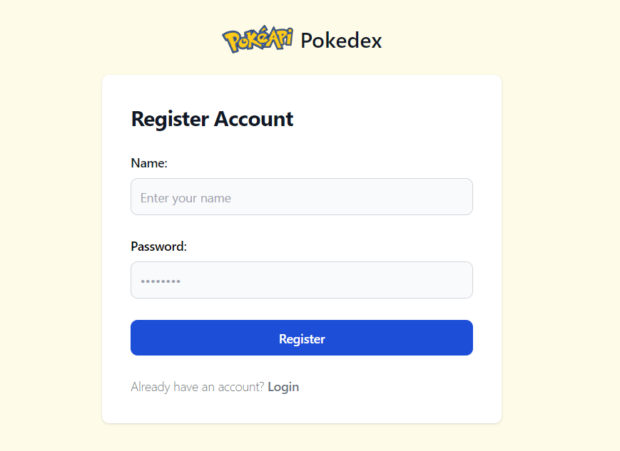
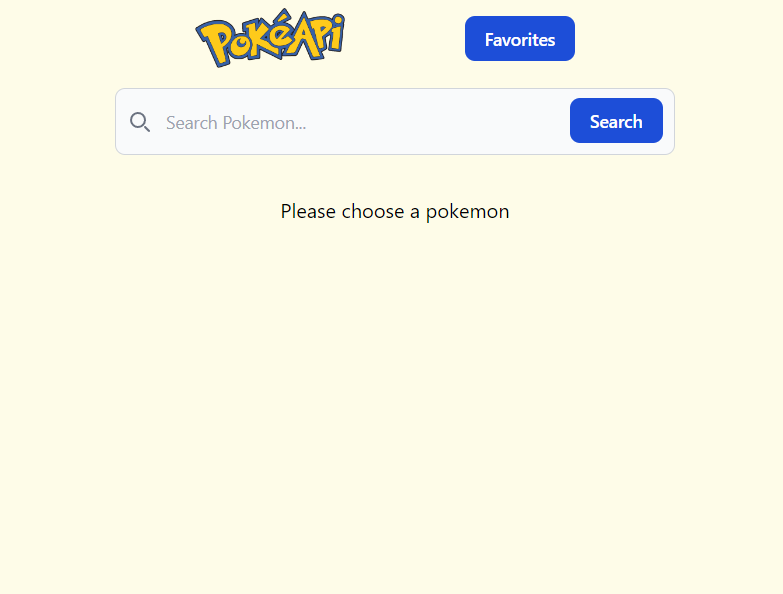

# T4 - Raden Wisnu Andhika Pranidhia

This is a second milestone project of RevoU Software developer. In this project, I worked around datas from pokeapi where I could utilizes the pokemon API to display information about pokemons. Various features implemented such as searching for pokemon and creating a list of favorite pokemons. The project covered various aspect of React, including TSX and Components, Hooks, States and Props, Forms and Events, and React Router.

Pokemon API = [pokeapi](https://pokeapi.co/)

This Project Web Link = [milestone-2-RWAndhika](https://milestone-2-rwandhika.netlify.app/)

## Usage

1. Register your account, becareful this account only saves one data on your own local storage. So If you tried to register twice, it will only has the last data registered.

2. Login with your registered account.

3. Try to search your desired pokemon. You can also try to add the pokemon into your favorite list and then it will be displayed on the favorite page.

